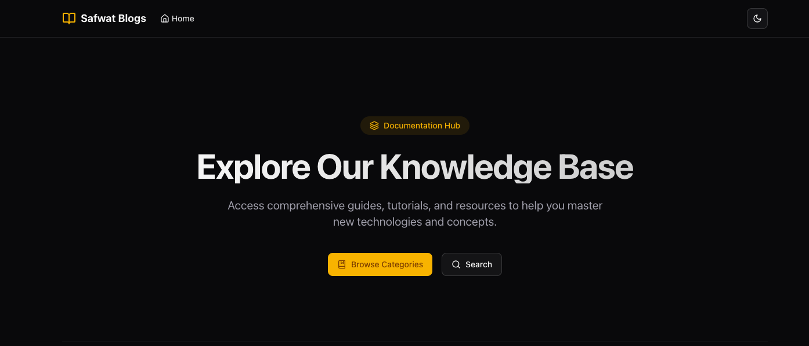

# Blog-next-app

# Next.js MDX Blog

A modern, performant, and SEO-friendly blog built with Next.js 13+, MDX, and Tailwind CSS. This blog features dynamic routing, server-side rendering, and a beautiful, responsive design.



## ✨ Features

- 🚀 Built with Next.js 13+ App Router
- 📝 MDX for rich content authoring
- 🎨 Styled with Tailwind CSS
- 🌓 Dark mode support
- 🔍 Full-text search functionality
- 📱 Fully responsive design
- ⚡ Optimized for performance
- 🔗 Dynamic routing for categories and posts

## 🛠️ Tech Stack

- **Framework**: Next.js 13+
- **Styling**: Tailwind CSS
- **Content**: MDX
- **Icons**: Lucide React
- **UI Components**: Shadcn/ui
- **Type Safety**: TypeScript

## 🚀 Getting Started

### Prerequisites

- Node.js 18.0.0 or later
- npm or yarn

### Installation

1. Clone the repository:
   ```bash
   git clone [https://github.com/your-username/nextjs-mdx-blog.git](https://github.com/your-username/nextjs-mdx-blog.git)
   cd nextjs-mdx-blog