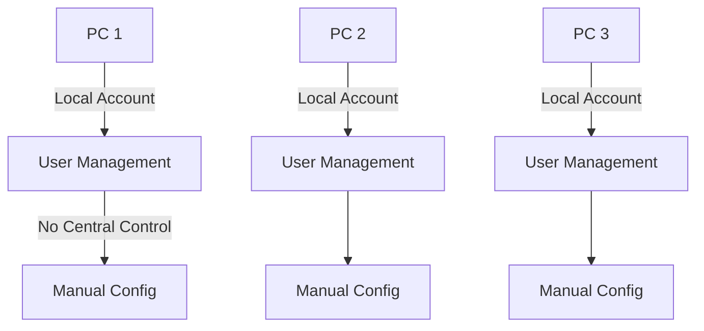
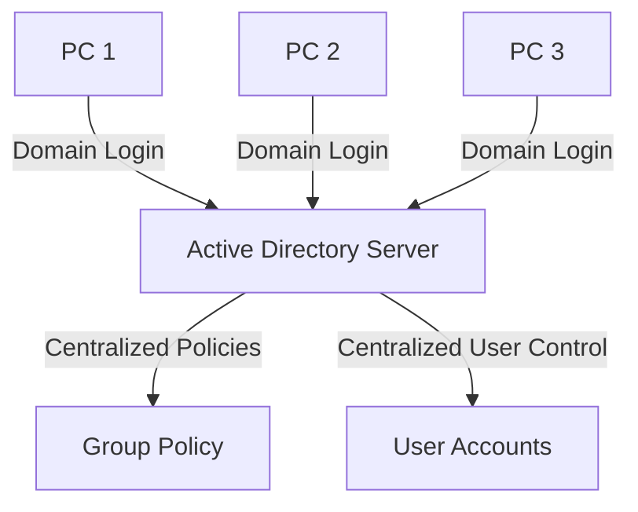
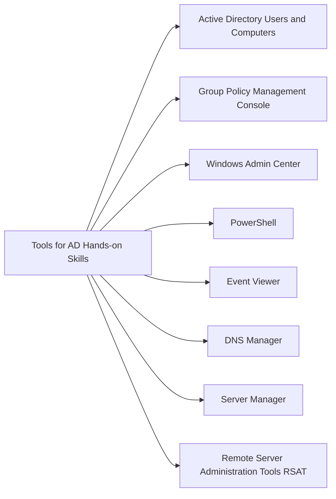

---

title: Introduction and Why Active Directory is Important for IT Support Roles
description: A hands-on introduction to Active Directory (AD), its role in enterprise IT infrastructure, and why it's an essential skill for IT support professionals.
----------------------------------------------------------------------------------------------------------------------------------------------------------------------

# 🛠️ Introduction to Active Directory (AD)

Active Directory (AD) is a directory service developed by Microsoft for Windows domain networks. It is used for organizing and managing users, computers, and other resources within a networked environment.

## 🧠 What is a Directory Service?

A directory service is a centralized database that stores information about users, computers, permissions, and more. Think of it as a phone book or a contact list—but for IT infrastructure.

AD uses **LDAP (Lightweight Directory Access Protocol)** as its foundation to query and modify items in the directory. It also relies on **Kerberos** for authentication and **DNS** for locating domain controllers.

## 🧩 Why AD Matters in IT Support Roles

Active Directory is not just for system administrators—IT support professionals frequently interact with it during day-to-day tasks like:

* Resetting user passwords
* Unlocking user accounts
* Creating new user accounts
* Assigning users to security groups
* Troubleshooting access issues

Understanding AD allows IT support professionals to troubleshoot efficiently and understand the structure behind most Windows-based enterprise environments.

## 🧑‍💻 Real-World Use Cases for IT Support

### 1. **User Management**

When a new employee joins, you’ll often:

* Create their user account
* Assign them to the appropriate department-based security groups
* Grant folder or email access

### 2. **Password & Account Issues**

Typical support tickets:

* "I forgot my password."
* "My account is locked."
* "I can't access the shared drive."

AD lets you quickly identify the issue and resolve it.

### 3. **Group Policy Issues**

Group Policies are settings that control user and computer environments. Understanding AD structure helps IT support recognize when:

* Mapped drives don’t appear
* Users can’t install software
* Desktop settings are not applying properly

## 🧭 How AD Fits in an Enterprise Environment

AD is often the backbone of network security and user management in companies of all sizes. Most organizations have a Windows Server with the AD Domain Services (AD DS) role installed. This server acts as a **Domain Controller (DC)** and handles:

* User authentication
* Authorization to resources
* Centralized user/group management

## 🏢 Example Company Scenario

**Scenario**: You work for a mid-sized company with 300 users.

* All employees use Windows PCs.
* New users must be added to specific security groups.
* Printer access is managed by department.
* Drive access is role-based.

---
Without AD:

* Each user would need to be managed manually on every machine.

---
With AD:

* You can manage all users centrally.
* Changes propagate across the domain.
* Security and organization are consistent.

---
## 🧰 Tools You Will Use

* **Active Directory Users and Computers (ADUC)**
* **Group Policy Management Console (GPMC)**
* **PowerShell** for scripting and automation

These tools are essential for support staff interacting with AD.

## 💡 Why Learn AD as an IT Support Professional?

1. **Widespread Adoption**: Most enterprises use AD.
2. **Job Readiness**: You’ll be expected to handle AD-related tasks.
3. **Career Progression**: Strong AD skills lead to sysadmin or security roles.
4. **Real-World Impact**: Faster issue resolution and better user support.

## 🏁 Summary

Active Directory is the core of user and resource management in Windows-based networks. For IT support professionals, understanding how it works enables:

* Faster troubleshooting
* Efficient user management
* Better collaboration with sysadmins and IT security teams

Next, we’ll compare **Workgroup vs Domain** to understand how AD differs from a basic peer-to-peer setup.

---

📌 *Stay tuned for the next file: Workgroup vs Domain*
