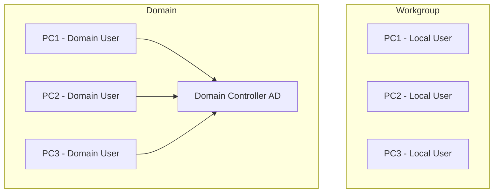

## 🧠 Understanding Workgroup vs Domain

In any Windows-based environment, managing multiple computers involves choosing between two fundamental networking models: **Workgroup** and **Domain**. Both serve to connect computers for resource sharing but differ in scale, control, and use cases.

---

## 🔹 What is a Workgroup?

A **Workgroup** is a peer-to-peer network model where:

* Each computer is **independent**.
* There is **no central control** or server.
* Every machine manages its own user accounts and permissions.
* Commonly used in **small networks** (home or small office).

### 🔑 Key Features of a Workgroup:

* All computers are equal (peers)
* User account must exist on **each computer** you want to access
* Settings and updates are managed **individually**
* Typically supports **10-20 computers**
* Computers are in the same local network

### 📌 Example Scenario:

If you have 5 laptops in a small office sharing files and printers, but each one logs in separately, that’s a Workgroup setup.

---

## 🔸 What is a Domain?

A **Domain** is a centralized model where:

* A **Domain Controller (DC)** manages all computers and users.
* It uses **Active Directory (AD)** to authenticate users.
* Settings, policies, and security are centrally managed.
* Suitable for **large organizations**.

### 🔑 Key Features of a Domain:

* Centralized authentication (login from any domain-connected PC)
* Admin can enforce **Group Policies** to manage security and settings
* Scalable to thousands of machines
* Domain users and permissions are stored in AD
* Requires a Windows Server with AD DS role installed

### 📌 Example Scenario:

In a corporate office, employees log in to any computer using their domain account, and policies (e.g., password rules, software restrictions) are pushed by IT. That’s a Domain environment.

---

## ⚖️ Comparison Table

| Feature             | Workgroup          | Domain                           |
| ------------------- | ------------------ | -------------------------------- |
| Control             | Local (each PC)    | Central (Domain Controller)      |
| User Authentication | Per Computer       | Centralized via Active Directory |
| Network Size        | Small (≤20 PCs)    | Large (100s to 1000s PCs)        |
| Resource Sharing    | Manual Setup       | Centrally Managed                |
| Management          | Decentralized      | Centralized                      |
| Ideal For           | Home, Small Office | Schools, Enterprises             |

---

## 🧰 When to Use What?

* Use a **Workgroup** when:

  * You have only a few computers
  * No dedicated IT team or admin server
  * Simpler management is preferred

* Use a **Domain** when:

  * You need central control over users/devices
  * Managing a large number of computers
  * Enforcing security and update policies is critical

---

## 📊 Diagram: Workgroup vs Domain

---

## ✅ Summary

| Workgroup                   | Domain                            |
| --------------------------- | --------------------------------- |
| Best for few PCs            | Best for many PCs                 |
| Local account on every PC   | Central account from AD           |
| No centralized management   | Full central control              |
| No domain controller needed | Needs a Domain Controller with AD |

Understanding this difference helps IT support professionals provide appropriate recommendations for system setup, troubleshooting, and security compliance in different environments.
