# 🛠️ Create Active Directory and Setup

Active Directory (AD) setup is one of the most important tasks for system administrators, especially in enterprise or small-business environments. This guide will help you configure your own AD environment from scratch using Windows Server.

## 📦 What You’ll Need

- A computer or virtual machine with **Windows Server 2016/2019/2022**
- Administrator access to the server
- Static IP address configured
- A planned domain name (e.g., `corp.local`)

```mermaid
flowchart TD
    A[💻 Computer / VM<br>Windows Server 2016/2019/2022] --> B[🔐 Admin Access]
    A --> C[🌐 Static IP Configured]
    A --> D[🏷️ Planned Domain Name<br>e.g., corp.local]
```

---

## 🧱 Step 1: Set a Static IP Address

Before installing Active Directory, it's recommended to assign a static IP address to the server.

1. Open **Server Manager** → Click on **Local Server**.
2. Under **Network**, click the Ethernet link.
3. In the network adapter settings:
   - Go to **Properties** → Select **IPv4** → Click **Properties**.
   - Choose **Use the following IP address** and configure:
     - IP: `192.168.1.10`
     - Subnet: `255.255.255.0`
     - Gateway: `192.168.1.1`
     - DNS: `127.0.0.1` (for local DNS)

---

## 🧰 Step 2: Install AD DS Role

1. Open **Server Manager**.
2. Click **Manage** → **Add Roles and Features**.
3. Proceed with **Role-based or feature-based installation**.
4. Select your server from the list.
5. In the **Roles** section, check **Active Directory Domain Services (AD DS)**.
6. It will auto-select required features. Click **Next** and complete the installation.
7. Reboot if required.

---

## 🧱 Step 3: Promote Server to Domain Controller

After the role is installed:

1. In **Server Manager**, click the yellow alert flag → **Promote this server to a domain controller**.
2. Choose **Add a new forest**, and specify your **root domain name** (e.g., `corp.local`).
3. Set the **Directory Services Restore Mode (DSRM) password** — keep this safe!
4. Click **Next** through the options, reviewing:
   - DNS options
   - NetBIOS name (auto-generated or customized)
   - Paths for AD database/logs/SYSVOL (default is fine)
5. Click **Install**. The server will reboot after promotion.

---

## 📁 Step 4: Verify the Domain

After reboot:

- Login using: `corp\Administrator`
- Open **Server Manager** and confirm roles:
  - AD DS
  - DNS

---

### Verify DNS:
- Open **DNS Manager**
- Ensure your domain (`corp.local`) is listed under Forward Lookup Zones.

## 👤 Step 5: Create Users and Organizational Units (OUs)

You now have a functioning domain controller! Let’s create a user and an OU.

1. Open **Active Directory Users and Computers (ADUC)** from the start menu.
2. Right-click on the domain → New → **Organizational Unit** → Name it e.g., `IT Department`.
3. Right-click the OU → New → **User**.
   - First name: `John`
   - Username: `john.doe`
   - Set a password and configure as required.

You can now log in to domain-joined computers using `corp\john.doe`.

```mermaid
flowchart TD
    A[Open Active Directory Users and Computers 'ADUC'] --> B[Right-click Domain]
    B --> C[New → Organizational Unit]
    C --> D[Name OU 'IT Department']
    D --> E[Right-click OU 'IT Department']
    E --> F[New → User]
    F --> G[Enter User Details: John Doe, username: john.doe]
    G --> H[Set Password & Configure Settings]
    H --> I[User Created in OU]
    I --> J[User can log in to domain-joined computers as corp\john.doe]
```

## 🧩 Optional: Join a Client to the Domain

On a Windows 10/11 machine:

1. Open **System Properties** → **Change settings** next to computer name.
2. Click **Change** → Select **Domain** and enter `corp.local`.
3. Enter domain admin credentials (`corp\Administrator`).
4. Reboot the machine.
5. Login using the domain user credentials created earlier.

## 📊 Diagram: AD Setup Workflow

# 🧠 Summary

You’ve now created your own **Active Directory** environment. This setup is foundational to managing users, groups, computers, and security policies in a domain.

✅ You’ve learned how to:

- Set up a **static IP address**
- Install the **Active Directory Domain Services (AD DS)** role
- Promote a server to a **Domain Controller**
- Create **Organizational Units (OUs)** and **users**
- Join **client machines** to the domain

This setup mirrors **real-world enterprise scenarios**, so take time to repeat and practice these steps until you're comfortable with every part of the process.