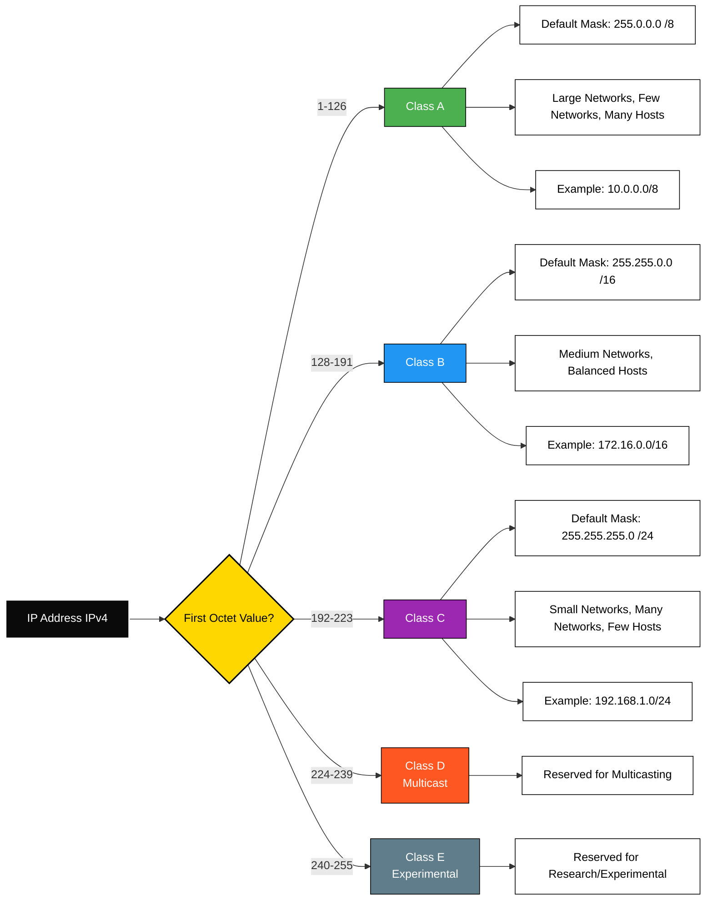
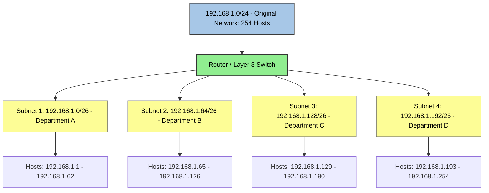
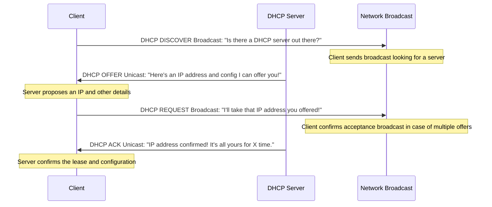
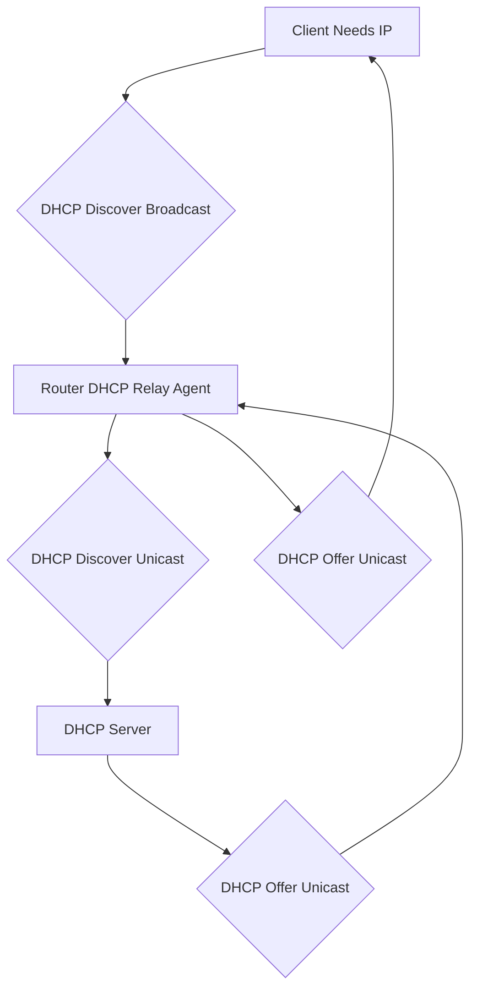

# 🌐 TCP/IP Basics

Understanding TCP/IP is essential for working in any networking or IT environment. This section introduces you to the foundational concepts that drive network communication.

---

## 🧮 Introduction to IP Addressing & Binary

Every device on a network is identified by an **IP address**. Behind the scenes, these addresses are just **32 bits** (for IPv4), divided into 4 groups called **octets**.

### 🧠 How Binary Works in IP Addresses

Each octet in an IP address can range from 0 to 255 and is represented by 8 binary digits. The positional values are:

`128`, `64`, `32`, `16`, `8`, `4`, `2`, `1`

To convert binary to decimal, add the values where there is a `1`.
Example:

Binary: `11000000`
`↑` `↑`
`128 + 64 = 192`

So, `11000000` = 192 in decimal.

Therefore, `11000000.10101000.00000001.00000001` in binary becomes:

`192.168.1.1`

> 📌 This is how IP addresses are built and interpreted in networking.

---

## 🔍 Introduction to ARP (Address Resolution Protocol)

**ARP** is a protocol used to map an **IP address** to a **MAC address**.

### 🛠️ How ARP Works:

1. A device wants to send data to an IP address (e.g., `192.168.1.5`).
2. It checks its **ARP cache** to see if it already knows the MAC address for that IP.
3. If not, it sends an **ARP request** broadcast on the local network:
   > "Who has `192.168.1.5`? Tell me your MAC address."
4. The device with that IP replies with its MAC address.
5. The sender stores this info in the ARP table and sends the data.

> 📘 ARP operates at **Layer 2 (Data Link)** of the OSI model, but helps bridge communication between **Layer 3 (Network)** and **Layer 2**.

---

## 💻 Common ARP Commands

The `arp` command is a fundamental tool for managing the ARP cache on various operating systems. While the basic functionality is similar, specific syntax and options can vary slightly between Windows, Linux, and macOS.

Here are the most common `arp` commands for each operating system:

### **1. Displaying the ARP Cache** 🗺️

This command shows the current entries in your system's ARP table.

* **Windows:**
    ```cmd
    arp -a
    ```
    or
    ```cmd
    arp -g
    ```
    (Both `-a` and `-g` show all entries, including dynamic and static.)

* **Linux:**
    ```bash
    arp -a
    ```
    or simply
    ```bash
    arp
    ```
    To display numeric IP and MAC addresses (without hostname resolution):
    ```bash
    arp -n
    ```

* **macOS:**
    ```bash
    arp -a
    ```
    Similar to Linux, you can also use `arp -n` for numeric output.

### **2. Adding a Static ARP Entry** ➕

Static ARP entries are manually added and remain in the ARP cache until explicitly deleted or the system restarts (unless marked as permanent). This can be useful for devices that might not always respond to ARP requests or for security purposes.

* **Windows:**
    ```cmd
    arp -s <IP_address> <MAC_address>
    ```
    **Example:**
    ```cmd
    arp -s 192.168.1.100 00-11-22-33-44-55
    ```
    *Note: This command usually requires administrator privileges.*

* **Linux:**
    ```bash
    sudo arp -s <IP_address> <MAC_address>
    ```
    **Example:**
    ```bash
    sudo arp -s 192.168.1.100 00:11:22:33:44:55
    ```
    To make the entry permanent (survive reboots), you often need to add it to a system configuration file (e.g., `/etc/ethers` or a network script), or use the `permanent` flag with some `ip` commands.

* **macOS:**
    ```bash
    sudo arp -s <IP_address> <MAC_address> [temp | pub [only]] [ifscope interface]
    ```
    **Example:**
    ```bash
    sudo arp -s 192.168.1.100 00:11:22:33:44:55
    ```
    * `temp`: (default) Entry is temporary.
    * `pub`: Makes the entry "published," meaning your system will act as an ARP server for that host (proxy ARP).
    * `ifscope interface`: Associates the entry strictly with a specific network interface (e.g., `en0`).
    To make an entry permanent across reboots on macOS, it's generally more involved and often requires creating a `launchd` plist file to execute the `arp -s` command at startup with root privileges.

### **3. Deleting an ARP Entry** ➖

This command removes a specific entry from the ARP cache.

* **Windows:**
    ```cmd
    arp -d <IP_address>
    ```
    **Example:**
    ```cmd
    arp -d 192.168.1.100
    ```

* **Linux:**
    ```bash
    sudo arp -d <IP_address>
    ```
    **Example:**
    ```bash
    sudo arp -d 192.168.1.100
    ```

* **macOS:**
    ```bash
    sudo arp -d <IP_address>
    ```
    **Example:**
    ```bash
    sudo arp -d 192.168.1.100
    ```
    You can also specify an interface scope if the entry was created with one:
    ```bash
    sudo arp -d 192.168.1.100 ifscope en0
    ```

### **4. Clearing the Entire ARP Cache** 🧹

While there isn't a direct `arp` command to clear the entire cache on all systems, there are workarounds.

* **Windows:**
    There isn't a single command to clear the *entire* dynamic ARP cache. You can use a loop to delete all dynamic entries, or restart the network adapter. For static entries, you must delete them individually.
    A common workaround is to disable/enable your network adapter, which flushes the dynamic entries.

* **Linux (using `ip` command - recommended for newer distributions):**
    ```bash
    sudo ip -s -s neigh flush all
    ```
    The `ip` command is a more modern and powerful tool for network configuration in Linux and is often preferred over `arp` for flushing the cache.

* **macOS:**
    ```bash
    sudo arp -a -d
    ```
    This command will delete *all* dynamic and static ARP entries from the cache.

### **5. Other Useful Options/Considerations** ⚙️

* **Permissions:** Many `arp` commands that modify the cache (add, delete) require administrative/root privileges. You'll often need to use `sudo` on Linux and macOS, or run Command Prompt/PowerShell as an administrator on Windows.
* **Dynamic vs. Static:** Dynamic entries are learned automatically and expire after a certain time. Static entries are permanent until manually removed.
* **Troubleshooting:** The `arp` command is invaluable for network troubleshooting, especially when devices cannot communicate despite having correct IP addresses. Checking the ARP cache can reveal issues like incorrect MAC address mappings.
* **Man Pages (macOS/Linux):** For comprehensive details on `arp` command options specific to your operating system, always consult the manual pages:
    ```bash
    man arp
    ```
    This will provide the most accurate and up-to-date information for your system.

---

## ➖ Subnet Mask

An **IP address** identifies a specific device on a network, but how does that device know which part of the IP address refers to the network it belongs to, and which part refers to the individual device itself? That's where the **subnet mask** comes in. 🎭

A subnet mask is a 32-bit number that, when combined with an IP address, divides the IP address into two parts: the **network portion** and the **host portion**.

* **Network Portion:** Identifies the specific network that the device is on. All devices on the same local network will have the same network portion of their IP address. 🏘️
* **Host Portion:** Identifies the specific device (host) within that network. Each device on a given network must have a unique host portion. 🏠

Think of it like an address for a house:
* **IP Address:** `192.168.1.10` (Specific house number and street)
* **Subnet Mask:** `255.255.255.0` (Defines which part is the street name and which is the house number)

In binary, the subnet mask consists of a series of `1`s for the network portion and a series of `0`s for the host portion. The `1`s must be contiguous, followed by contiguous `0`s.

**Example:**
Let's take the IP address `192.168.1.10` and a common subnet mask `255.255.255.0`.

To find the Network Address, you perform a bitwise AND operation between the IP address and the subnet mask:

* Where the subnet mask has a `1`, the corresponding bit in the IP address is part of the network address.
* Where the subnet mask has a `0`, the corresponding bit in the IP address is part of the host address (and becomes `0` for the network address).

|           | **First Octet** | **Second Octet** | **Third Octet** | **Fourth Octet** |
| :-------- | :-------------- | :--------------- | :-------------- | :--------------- |
| IP Address (Binary) | `11000000`      | `10101000`       | `00000001`      | `00001010`       |
| Subnet Mask (Binary)| `11111111`      | `11111111`       | `11111111`      | `00000000`       |
| **Network Address (Binary)** | **`11000000`** | **`10101000`** | **`00000001`** | **`00000000`** |
| **Network Address (Decimal)**| **192** | **168** | **1** | **0** |

So, for `192.168.1.10` with subnet mask `255.255.255.0`, the network address is `192.168.1.0`. All devices on this network will have an IP address that starts with `192.168.1`. The remaining bits (the last 8 bits in this example) are for the host.

### **FLSM (Fixed Length Subnet Masking)** 📏

FLSM is a traditional subnetting approach where all subnets within a larger network use the **same subnet mask**. This means that each subnet has the same number of available host IP addresses.

**Example:**
Imagine you have a Class C network `192.168.1.0/24`. If you decide to create 4 subnets, using FLSM, each of those 4 subnets will have the exact same number of hosts. This can lead to wasted IP addresses if some subnets require many hosts and others require very few. 🚧

* You borrow bits from the host portion to create subnets.
* The number of borrowed bits determines the number of subnets and the number of hosts per subnet.
* The subnet mask is consistent across all created subnets.

**Pros of FLSM:**
* Simpler to understand and implement.
* Easier to calculate network ranges.

**Cons of FLSM:**
* Can lead to significant IP address waste if network segments have vastly different host requirements. 🗑️

### **VLSM (Variable Length Subnet Masking)** 📐

VLSM is a more efficient subnetting technique that allows for the use of **different subnet masks** for different subnets within the same larger network. This enables network administrators to create subnets that are precisely sized for the number of hosts they need, thus conserving IP addresses.

**Example:**
Using the same `192.168.1.0/24` network, with VLSM, you could have:
* One subnet for 50 hosts (e.g., `/26`)
* Another subnet for 10 hosts (e.g., `/28`)
* Another subnet for point-to-point links (e.g., `/30`, which allows only 2 hosts)

VLSM works by taking a subnet created with a certain mask and further subnetting *that* subnet with a longer (more specific) mask. This hierarchical approach maximizes IP address utilization. 🌳

**Pros of VLSM:**
* **Efficient IP address utilization:** Minimizes wasted IP addresses by tailoring subnet size to actual needs. ♻️
* Greater flexibility in network design.
* Supports larger, more complex network topologies.

**Cons of VLSM:**
* More complex to plan and implement compared to FLSM.
* Requires a deeper understanding of subnetting.
* Can be harder to troubleshoot if not well-documented. 🧐

> 💡 **Key Difference:** FLSM is like buying all your clothes in one size. VLSM is like buying different sized clothes for different parts of your body, fitting perfectly and wasting less fabric. 👗👖👕

---

## 🏛️ Classful Addressing

Classful addressing was the original system for categorizing IP addresses (IPv4) based on their first few bits. It divided the entire IPv4 address space into predefined classes (A, B, C, D, and E), each with a fixed network and host portion. While largely superseded by Classless Inter-Domain Routing (CIDR) and VLSM, understanding classful addressing is foundational. 📜

### **IANA and RIRs**

Before delving into the classes, it's important to understand how IP addresses are managed globally. 🌍

* **IANA (Internet Assigned Numbers Authority):** This is the global organization responsible for coordinating the Internet's global IP addressing system, as well as managing domain names and protocol parameters. IANA assigns large blocks of IP addresses to five regional Internet registries (RIRs). 🌐

* **RIRs (Regional Internet Registries):** These are organizations responsible for allocating and registering Internet number resources (like IP addresses and Autonomous System Numbers) within their respective geographical regions. There are five RIRs: 🗺️

    * **AFRINIC (African Network Information Centre):** Services the continent of Africa. 🌍
    * **APNIC (Asia Pacific Network Information Centre):** Services Asia, Australia, New Zealand, and surrounding Pacific nations. 🌏
    * **ARIN (American Registry for Internet Numbers):** Services the United States, Canada, and many Caribbean and North Atlantic islands. 🇺🇸🇨🇦
    * **LACNIC (Latin America and Caribbean Network Information Centre):** Services Latin America and some Caribbean islands. 🇧🇷🇦🇷
    * **RIPE NCC (Réseaux IP Européens Network Coordination Centre):** Services Europe, the Middle East, and parts of Central Asia. 🇪🇺🇸🇦

These RIRs, in turn, allocate smaller blocks of IP addresses to Internet Service Providers (ISPs) and other organizations within their regions.

### **IP Address Classes (IPv4)**

Here's a breakdown of the traditional IPv4 classes:

#### **Class A** 🅰️

* **First Octet Range:** `1-126`
* **Binary Prefix:** `0xxxxxxx` (The first bit is always 0)
* **Default Subnet Mask:** `255.0.0.0` or `/8` (meaning the first 8 bits are for the network)
* **Network/Host Split:** 8 bits for Network, 24 bits for Host
* **Number of Networks:** 2^7 - 2 = 126 (`0.0.0.0` and `127.0.0.0` are reserved)
* **Hosts per Network:** 2^{24} - 2 = 16,777,214 (2 addresses reserved: network address and broadcast address)

    * **Explanation:** Class A networks are designed for very large organizations or national networks that require a massive number of hosts. They have very few networks but each network can accommodate millions of devices. 🏢
    * **Example IP:** `10.x.x.x` (Private Class A range: `10.0.0.0 - 10.255.255.255`)

#### **Class B** 🅱️

* **First Octet Range:** `128-191`
* **Binary Prefix:** `10xxxxxx` (The first two bits are always 10)
* **Default Subnet Mask:** `255.255.0.0` or `/16` (meaning the first 16 bits are for the network)
* **Network/Host Split:** 16 bits for Network, 16 bits for Host
* **Number of Networks:** 2^{14} = 16,384
* **Hosts per Network:** 2^{16} - 2 = 65,534

    * **Explanation:** Class B networks are for medium to large-sized organizations. They offer a good balance between the number of networks and the number of hosts per network. 💼
    * **Example IP:** `172.16.x.x` (Private Class B range: `172.16.0.0 - 172.31.255.255`)

#### **Class C** 🅲

* **First Octet Range:** `192-223`
* **Binary Prefix:** `110xxxxx` (The first three bits are always 110)
* **Default Subnet Mask:** `255.255.255.0` or `/24` (meaning the first 24 bits are for the network)
* **Network/Host Split:** 24 bits for Network, 8 bits for Host
* **Number of Networks:** 2^{21} = 2,097,152
* **Hosts per Network:** 2^8 - 2 = 254

    * **Explanation:** Class C networks are the most common and are suitable for small to medium-sized organizations. They allow for many networks but with a limited number of hosts per network. 🏡
    * **Example IP:** `192.168.1.x` (Private Class C range: `192.168.0.0 - 192.168.255.255`)

#### **Class D (Multicast)** 🅳

* **First Octet Range:** `224-239`
* **Binary Prefix:** `1110xxxx`
* **Default Subnet Mask:** N/A (not used for unicast routing)
* **Explanation:** Class D addresses are reserved for **multicasting**. Multicasting is a method of sending a single packet to a select group of recipients simultaneously, rather than to a single recipient (unicast) or all recipients (broadcast). Examples include video conferencing, streaming media, and dynamic routing protocols. 🗣️🎥

#### **Class E (Experimental/Reserved)** 🅴

* **First Octet Range:** `240-255`
* **Binary Prefix:** `1111xxxx`
* **Default Subnet Mask:** N/A
* **Explanation:** Class E addresses are reserved for experimental and research purposes and are not used for public or private network addressing. 🧪🔬

> ⚠️ **The Demise of Classful Addressing:** While understanding classful addressing is important for historical context and foundational knowledge, the Internet largely moved away from it with the introduction of **CIDR (Classless Inter-Domain Routing)** in the early 1990s. CIDR, combined with VLSM, made IP address allocation much more efficient and flexible, addressing the rapid depletion of IPv4 addresses that classful addressing caused. In modern networks, you will almost exclusively see IP addresses referred to with CIDR notation (e.g., `192.168.1.0/24`), which explicitly defines the network portion using a prefix length, regardless of its traditional class.  obsolescence


---

## 🚀 Subnetting with CIDR (Classless Inter-Domain Routing)

CIDR (pronounced "cider") is the modern and highly efficient way to do subnetting. It replaced the old classful system because it allows for much more flexible and granular allocation of IP addresses, helping to conserve the dwindling IPv4 address space.

The core idea of CIDR is that the "class" of an IP address (A, B, C) no longer dictates the size of the network. Instead, the network portion is determined by a **prefix length**, which is indicated by a slash (`/`) followed by a number. This number tells you exactly how many bits from the left-most side of the IP address are part of the network address. The remaining bits are for the host addresses.

### **How CIDR Works: The Magic of the Slash Notation** ✨

Let's break down `192.168.1.0/24`:

* **`192.168.1.0`**: This is the IP address itself (or in this case, a network address).
* **`/24`**: This is the CIDR prefix length. It means the **first 24 bits** of the 32-bit IP address are dedicated to the network portion. The remaining `32 - 24 = 8` bits are for the host portion.

This `/24` notation directly implies the subnet mask:
* 24 bits are `1`s: `11111111.11111111.11111111.00000000`
* Which translates to decimal: `255.255.255.0`

### **The Power of Subnetting with CIDR** 💪

Subnetting with CIDR means taking a larger IP address range (a larger network) and dividing it into smaller, more manageable sub-networks. This is crucial for:

* **Efficiency:** Preventing IP address waste by creating subnets that are just the right size for your needs. 🎯
* **Security:** Isolating network segments to limit broadcast domains and potential security breaches. 🔒
* **Performance:** Reducing broadcast traffic on segments. ⚡
* **Organization:** Structuring large networks logically. 📂

### **Easy Steps for Subnetting with CIDR** 🚶‍♂️🚶‍♀️

Let's use an example to make it super clear!

**Scenario:** You have the network `192.168.1.0/24` and you need to create subnets for different departments. You decide you need a subnet that can support around **50 hosts**.

**Step 1: Understand Your Starting Network** 🎯

* **Given IP Network:** `192.168.1.0/24`
* **Total bits:** 32
* **Network bits:** 24 (The `/24` tells us this)
* **Host bits:** `32 - 24 = 8`
* **Total possible hosts in original network:** 2^8 - 2 = 256 - 2 = 254 (remember to subtract 2 for network and broadcast addresses). This is enough for 50 hosts, but we want to divide it.

**Step 2: Determine Required Host Bits for New Subnet** 🤔

* You need to support at least 50 hosts.
* We need to find the smallest power of 2 that is greater than or equal to `(number of hosts + 2)` (for network and broadcast).
* 2^x >= 50 + 2
* 2^x >= 52
* Let's check powers of 2:
    * 2^1 = 2
    * 2^2 = 4
    * 2^3 = 8
    * 2^4 = 16
    * 2^5 = 32
    * 2^6 = 64
* So, we need at least 6 host bits (`2^6 = 64` addresses, which is 62 usable hosts).

**Step 3: Calculate the New CIDR Prefix Length** 🔗

* Original total bits: 32
* New host bits needed: 6
* **New Network Bits (Prefix Length):** `32 - 6 = 26`
* So, our new subnet will have a `/26` prefix.

**Step 4: Determine the New Subnet Mask** 📝

* A `/26` prefix means 26 bits are `1`s.
* In binary: `11111111.11111111.11111111.11000000`
* Convert to Decimal: `255.255.255.192` (The last octet `11000000` is 128 + 64 = 192)

**Step 5: Identify the Subnet Ranges** 🏷️

Now that we know our new subnets will be `/26`, we can figure out the actual network addresses and broadcast addresses. Each `/26` subnet will jump by a "block size" determined by the value of the last `1` bit in the subnet mask's last octet. In `255.255.255.192`, the last `1` is in the `64`'s place.

So, the subnets will increase in increments of **64** in the last octet:

**Subnetting Table for `192.168.1.0/24` into `/26` Subnets:**

| Subnet Number | Network Address | CIDR | Subnet Mask     | Usable IP Range          | Broadcast Address | Total Addresses | Usable Hosts |
| :------------ | :-------------- | :--- | :-------------- | :----------------------- | :---------------- | :-------------- | :----------- |
| 1             | `192.168.1.0`   | `/26`| `255.255.255.192` | `192.168.1.1 - 192.168.1.62` | `192.168.1.63`    | 64              | 62           |
| 2             | `192.168.1.64`  | `/26`| `255.255.255.192` | `192.168.1.65 - 192.168.1.126`| `192.168.1.127`   | 64              | 62           |
| 3             | `192.168.1.128` | `/26`| `255.255.255.192` | `192.168.1.129 - 192.168.1.190`| `192.168.1.191`   | 64              | 62           |
| 4             | `192.168.1.192` | `/26`| `255.255.255.192` | `192.168.1.193 - 192.168.1.254`| `192.168.1.255`   | 64              | 62           |

> 🚀 **Why is this so great?** We started with one network (`192.168.1.0/24`) and carved it into four smaller, perfectly sized subnets. Each of these subnets can be assigned to a different department, floor, or purpose, improving network management and efficiency. This is the essence of **VLSM** combined with **CIDR**!

### **Visualizing Subnetting with a Diagram** 📊

Let's imagine our original `192.168.1.0/24` network as a large building with many rooms (IP addresses). We want to divide it into smaller, separate departments.




# Dynamic vs. Static IP Addresses: The Great Debate! 🤝

Imagine your computer or phone needing an address to find its way on the internet. That's an IP address! But how does it get one? That's where dynamic and static come in.

## Static IP Address: The Permanent Resident 🏡

A static IP address is like having a fixed home address. It's manually assigned to a device and *never* changes unless you manually change it again.

**When to use it:**

* **Servers:** Web servers, email servers, database servers, etc., need a consistent address so other devices can always find them.
* **Network Devices:** Routers, firewalls, and managed switches often have static IPs for consistent management access.
* **Printers:** So users don't have to constantly search for the printer.
* **Specific Applications:** Some specialized applications or services might require a static IP.

**Pros:**

* **Predictable:** Always the same, easy to find.
* **Direct Access:** Ideal for hosting services.
* **Simpler DNS Resolution:** For internal services, it might simplify configuration.

**Cons:**

* **Manual Management:** More administrative overhead, especially in large networks.
* **IP Exhaustion:** If not managed carefully, you can run out of addresses.
* **Configuration Errors:** Higher chance of typos leading to IP conflicts.

## Dynamic IP Address: The Frequent Traveler ✈️

A dynamic IP address is like getting a temporary address when you check into a hotel. It's automatically assigned to a device for a limited time (a "lease") and can change when the lease expires or the device reconnects.

**When to use it:**

* **Client Devices:** Laptops, smartphones, tablets, desktop PCs – anything that connects and disconnects frequently.
* **Large Networks:** Where manual configuration would be a nightmare.
* **Guest Networks:** For temporary users.

**Pros:**

* **Automated Management:** No manual intervention needed.
* **Efficient IP Use:** Addresses are reused when devices disconnect.
* **Reduces Conflicts:** The server ensures unique assignments.
* **Scalability:** Easily add or remove devices without reconfiguring the network.

**Cons:**

* **Unpredictable:** The IP address can change, making it harder for other devices to directly access services hosted on it (though DNS can mitigate this for public services).
* **Debugging Can Be Trickier:** If an issue is IP-related, finding the device by its IP can be harder if it keeps changing.

## DHCP: The IP Address Butler 🤵‍♂️

**DHCP (Dynamic Host Configuration Protocol)** is the hero of dynamic IP assignment. It's a network protocol that automatically assigns IP addresses and other network configuration parameters (like subnet mask, default gateway, DNS servers) to devices connected to an IP network.

### How DHCP Works: The Four-Step Dance (DORA) 💃🕺

The process of a client obtaining an IP address from a DHCP server is often described by the **DORA** acronym: **Discover, Offer, Request, Acknowledge**.



# Discover:

The client (e.g., your laptop) powers on and needs an IP address. It doesn't know the DHCP server's IP, so it sends a DHCP Discover message as a broadcast to 255.255.255.255 (or 0.0.0.0 as its source IP).

This message essentially says, "Is there a DHCP server out there who can give me an IP address?"

# Offer:

Any DHCP server that receives the Discover message checks its available IP pool.

It then sends a DHCP Offer message to the client (usually unicast to the client's MAC address if it knows it, or broadcast if not).

This message contains a proposed IP address for the client, a subnet mask, lease duration, and the server's own IP address.

# Request:

The client receives the DHCP Offer. If there are multiple offers, it usually accepts the first one it receives.

The client then sends a DHCP Request message (again, typically broadcast) back to the DHCP server (or all DHCP servers if it received multiple offers) to formally accept the offered IP address.

This broadcast is crucial because it informs other DHCP servers that their offers were not accepted, allowing them to reclaim the offered IP addresses.

# Acknowledge (ACK):

The DHCP server receives the DHCP Request.

It then sends a DHCP Acknowledge (ACK) message to the client. This is the final confirmation.

The ACK message contains the confirmed IP address, subnet mask, default gateway, DNS server addresses, and the actual lease time. At this point, the client fully configures its network interface with the received parameters.

# Key DHCP Concepts:

- **Address Scope (Pool)**: A range of IP addresses that the DHCP server is configured to lease out. For example, 192.168.1.100 to 192.168.1.200.
- **Lease**: The period of time an IP address is assigned to a client. When half the lease time expires, the client will attempt to renew its lease with the DHCP server. If the server is unavailable, it will try again at 87.5% of the lease time. If renewal fails, the client will start the DORA process from scratch.
- **DHCP Relay Agent**: What if your DHCP server is on a different network segment than your clients? Broadcasts (like DHCP Discover) don't cross routers by default. A DHCP Relay Agent (often configured on the router itself) captures DHCP broadcasts and forwards them as unicast messages to the DHCP server. This saves you from needing a DHCP server on every subnet.



# Exclusion

Specific IP addresses within a DHCP scope that should not be assigned by the DHCP server. These are typically reserved for static assignments (e.g., servers, printers) or network devices.

# Reservation (Static DHCP Assignment)

Assigning a specific IP address from the DHCP pool to a device based on its MAC address. This provides the benefits of DHCP (automatic configuration) but ensures a device always gets the same IP address, effectively acting like a static IP for that specific device without manual configuration on the device.

# SLAAC (Stateless Address Autoconfiguration)

This is an IPv6-specific method for devices to automatically configure their IP addresses without a central server (like DHCP). It uses a combination of the network prefix advertised by a router (Router Advertisement - RA) and the device's own MAC address to generate a unique IPv6 address. It's "stateless" because the router doesn't keep a record of assigned addresses. DHCPv6 (the IPv6 version of DHCP) can also be used, sometimes in conjunction with SLAAC for additional parameters (stateful DHCPv6).

# BOOTP: DHCP's Grandfather 👴

BOOTP (Bootstrap Protocol) is an older, simpler protocol than DHCP. It was primarily used for diskless workstations to obtain their IP address, hostname, and the location of a boot file (e.g., an operating system image) at startup.

## How it works (Simplified):

1. Client sends a BOOTP request (broadcast).
2. BOOTP server responds with the IP address and boot file information.

## Key Differences from DHCP:

- No Lease Times: BOOTP assigns permanent IP addresses.
- No Address Pools: IP addresses are usually pre-assigned in a database based on MAC address.
- Less Information: BOOTP provides less network configuration information compared to DHCP.
- Fixed Boot File: Primarily designed for booting from a network.

While BOOTP still exists and is supported by some devices (especially older ones or for specific PXE boot scenarios), DHCP has largely replaced it due to its greater flexibility, automatic management, and comprehensive set of configuration options.

# How to Configure IP Addressing

Configuration varies significantly based on the device and operating system, but here are general steps for common scenarios:

## 1. Configuring a Router as a DHCP Server

Most home and small office routers come with a DHCP server enabled by default. For enterprise-grade routers (like Cisco, Juniper, etc.), you'd configure it via command-line interface (CLI).

**Example (Cisco IOS CLI):**

```bash
Router> enable
Router# configure terminal
Router(config)# ip dhcp pool LAN_POOL
Router(dhcp-config)# network 192.168.1.0 255.255.255.0  // Network to serve IPs from
Router(dhcp-config)# default-router 192.168.1.1      // Your router's LAN IP
Router(dhcp-config)# dns-server 8.8.8.8 8.8.4.4    // Google's public DNS
Router(dhcp-config)# lease 0 8 0                 // Lease time: 8 hours (days hours minutes)
Router(dhcp-config)# exit
Router(config)# ip dhcp excluded-address 192.168.1.1 192.168.1.99 // Exclude IPs for static use
Router(config)# interface GigabitEthernet0/0      // Interface connected to the LAN
Router(config-if)# ip address 192.168.1.1 255.255.255.0 // Assign static IP to interface
Router(config-if)# no shutdown
Router(config-if)# exit
Router(config)# service dhcp                     // Ensure DHCP service is running
Router(config)# end
Router# write memory
```
## 2. Configuring a Windows Server as a DHCP Server

Windows Server offers a robust DHCP role.

### Install DHCP Role:

- Open Server Manager > Add Roles and Features.
- Select "DHCP Server" and follow the wizard.

### Authorize DHCP Server:

After installation, you'll need to authorize the server in Active Directory (if applicable) from the DHCP console.

### Create a New Scope:

- Open DHCP Management Console (`dhcpmgmt.msc`).
- Right-click on IPv4 > New Scope.
  
#### Follow the New Scope Wizard:

- **Name:** e.g., "Main Office Network"
- **IP Address Range:** e.g., `192.168.1.100` to `192.168.1.200`
- **Subnet Mask:** `255.255.255.0`
- **Exclusions:** Add any IPs you want to reserve for static assignment.
- **Lease Duration:** Default is 8 days, adjust as needed.
- **Router (Default Gateway):** e.g., `192.168.1.1`
- **DNS Servers:** e.g., `8.8.8.8`, `8.8.4.4`
- **Activate Scope:** Yes, activate it now.

### Optional: Configure Reservations:

Under your scope, right-click "Reservations" > "New Reservation".

Enter a name, the desired IP address, and the MAC address of the device.

## 3. Configuring a Firewall with DHCP Server Functionality

Many firewalls (e.g., FortiGate, Palo Alto, pfSense) can also act as DHCP servers for their connected interfaces. The configuration is usually done via a Web UI.

### General Steps (Web UI based):

- Navigate to Network/Interfaces: Find the interface you want to enable DHCP on (e.g., LAN interface).
- Enable DHCP Server: Check the "Enable DHCP Server" box.
- Define IP Range: Specify the start and end IP addresses for the DHCP pool.
- Set Lease Time: Configure the duration.
- Specify Gateway/DNS: Usually, the firewall's IP on that interface will be the default gateway. Add DNS servers.
- Add Exclusions/Reservations (if supported): Configure as needed.
- Save/Apply Changes.

## 4. Configuring a Router/Firewall as a DHCP Relay Agent

As mentioned, a DHCP Relay Agent is used when the DHCP server is on a different subnet. This is configured on the router/firewall that connects the client's subnet to the server's subnet.

### Example (Cisco IOS CLI for Relay Agent):

Assume clients are on `10.0.1.0/24` and the DHCP server is on `10.0.10.0/24` with the IP `10.0.10.50`. The router interfaces are `GigabitEthernet0/0` (for clients) and `GigabitEthernet0/1` (for server).

```bash
Router> enable
Router# configure terminal
Router(config)# interface GigabitEthernet0/0
Router(config-if)# ip address 10.0.1.1 255.255.255.0 // IP for client-facing interface
Router(config-if)# ip helper-address 10.0.10.50     // This is the DHCP relay command!
Router(config-if)# no shutdown
Router(config-if)# exit
Router(config)# interface GigabitEthernet0/1
Router(config-if)# ip address 10.0.10.1 255.255.255.0 // IP for server-facing interface
Router(config-if)# no shutdown
Router(config-if)# end
Router# write memory
```

This configuration ensures that any DHCP Discover broadcasts received on GigabitEthernet0/0 are forwarded as unicast messages to the DHCP server at 10.0.10.50.


# 🔐 Special Private IP Address Ranges

Private IP addresses are reserved ranges that are **not routable on the public internet**. These IPs are used **within local networks** like homes, offices, data centers, and virtual environments (e.g. Docker, Kubernetes, etc.).

They are defined by **RFC 1918**.

---

## 🧭 Why Use Private IPs?

- 🚫 Not reachable from the public internet
- 🏠 Used for internal/local communication
- 🔄 NAT (Network Address Translation) allows private IPs to access the internet via public IPs
- 💰 Saves IPv4 address space

---

## 📦 Private IP Ranges

### 🟢 `10.0.0.0/8`

- Range: `10.0.0.0` → `10.255.255.255`
- Total addresses: **16,777,216**
- CIDR Notation: `/8`

> ✅ Ideal for large enterprises or ISPs who need huge internal address space.

---

### 🔵 `172.16.0.0/12`

- Range: `172.16.0.0` → `172.31.255.255`
- Total addresses: **1,048,576**
- CIDR Notation: `/12`

> 🧠 Often used in VPNs, container environments (e.g., Docker), and corporate LANs.

> ❗ Common mistake: **only** `172.16.0.0` to `172.31.255.255` is private.  
> `172.32.0.0` and above is **not** private!

---

### 🟡 `192.168.0.0/16`

- Range: `192.168.0.0` → `192.168.255.255`
- Total addresses: **65,536**
- CIDR Notation: `/16`

> 🏠 Most common private range used in **home routers** (e.g., `192.168.1.1`)

---

## 🕵️ How Private IPs Are Used

| Usage                          | Example Range       | Notes                           |
|-------------------------------|---------------------|----------------------------------|
| Home Wi-Fi networks           | `192.168.1.0/24`    | Default router networks         |
| Docker bridge networks        | `172.17.0.0/16`     | Default Docker subnet           |
| Corporate LANs & VPNs         | `10.0.0.0/8`        | Massive internal networks       |
| Kubernetes pod/service IPs    | Custom CIDRs        | Configurable, often private IPs |

---

## 🌐 NAT: Getting to the Internet

Private IPs can’t communicate directly with public networks.  
So we use **NAT (Network Address Translation)**:

```plaintext
Private IP → Router with Public IP → Internet
```

# 🔐 Special IP Address Ranges

There are several **reserved IP address ranges** defined for specific uses in networking. These IPs are **not routable on the public internet** and serve special purposes.

---

## 📦 Private IP Ranges (RFC 1918)

Private IPs are used **within internal networks** like homes, offices, cloud infrastructure, and containers.

### 🟢 `10.0.0.0/8`

- Range: `10.0.0.0` → `10.255.255.255`
- Total addresses: **16,777,216**
- CIDR: `/8`
- ✅ Great for large organizations

---

### 🔵 `172.16.0.0/12`

- Range: `172.16.0.0` → `172.31.255.255`
- Total addresses: **1,048,576**
- CIDR: `/12`
- ⚠️ Only `172.16.x.x` to `172.31.x.x` is private — `172.32.x.x` is **not**

---

### 🟡 `192.168.0.0/16`

- Range: `192.168.0.0` → `192.168.255.255`
- Total addresses: **65,536**
- CIDR: `/16`
- 🏠 Default for **home routers**, e.g., `192.168.1.1`

---

## 💡 Loopback Address (Localhost)

The **loopback** address allows a device to **talk to itself** — useful for testing local apps and services.

### 🔁 `127.0.0.1`

- CIDR: `127.0.0.0/8`
- Most common: `127.0.0.1`
- Hostname: `localhost`
- 🧪 Used for: Testing servers on your own machine

> Ping `127.0.0.1` to test if TCP/IP stack is working locally!

---

## ⚡ APIPA (Automatic Private IP Addressing)

APIPA assigns an IP **automatically** when a device **can’t reach a DHCP server**.

### 🚨 `169.254.0.0/16`

- Range: `169.254.0.1` → `169.254.255.254`
- CIDR: `/16`
- Used **only in the local subnet**
- ❌ Can’t access the internet with this address
- 💡 Often a sign of **network or DHCP issues**

> E.g., if your PC shows `169.254.x.x`, it failed to get a valid IP from DHCP.

---

## 🧠 Summary Table

| Type        | IP Range / Example         | CIDR        | Use Case                            |
|-------------|----------------------------|-------------|-------------------------------------|
| Private     | `10.0.0.0` – `10.255.255.255` | `/8`       | Large private networks              |
| Private     | `172.16.0.0` – `172.31.255.255` | `/12`    | Mid-sized networks, containers      |
| Private     | `192.168.0.0` – `192.168.255.255` | `/16`  | Home and small office networks      |
| Loopback    | `127.0.0.1`                 | `/8`        | Test local host                     |
| APIPA       | `169.254.0.0` – `169.254.255.255` | `/16` | Fallback if DHCP fails              |

---

## 🧪 Quick Quiz

> Your laptop has the IP `169.254.88.10`. What's the issue?

<details>
<summary>Answer</summary>

Your device couldn’t contact the DHCP server.  
This is an **APIPA address**, and your network isn't assigning IPs correctly.

</details>

---

## 🚀 What’s Next?

In the next module, we’ll look at:

- 🌐 **Public IPs**
- 📣 **Multicast & Broadcast**
- 🌍 **IP Address Classes**

Stay curious and keep networking fun!