# Routing & NAT Basics

## Introduction to Routers
Routers connect different networks and forward data packets between them. They operate at Layer 3 of the OSI model and determine the best path for data using routing tables and protocols.

## NAT (Network Address Translation)
NAT allows multiple devices on a private network to share a single public IP address.

### Types of NAT:
- **Static NAT**: One-to-one mapping between private and public IP.
- **Dynamic NAT**: Public IP is picked from a pool.
- **PAT (Port Address Translation)** aka NAT Overload: Many private IPs share one public IP using different ports.

### Implementing NAT:
- Configured on the router/firewall.
- Useful for home users and businesses to access the internet without exposing private IPs.

## Port Forwarding

### SOHO DMZ:
- Places one device "outside" the firewall for unrestricted access, used for gaming, hosting.

### Port Triggering:
- Opens ports dynamically when a specific outbound port is triggered.

### Port Range Forwarding:
- Forwards a range of ports to a device (e.g., online games or servers).

## Tour of a SOHO Router
- Basic UI with tabs like **Status**, **Wireless**, **NAT**, **Firewall**, **Port Forwarding**.
- Limited routing features compared to enterprise routers.

## SOHO vs Enterprise Routers
| Feature | SOHO | Enterprise |
|--------|------|------------|
| Users Supported | Few | Thousands |
| Performance | Moderate | High |
| Configuration | Basic | Advanced CLI/API |
| Security | Basic | Advanced (IDS/IPS, ACLs) |
| Price | Low | High |

```mermaid
graph LR
    A[Router Type] --> B[SOHO Router]
    A --> C[Enterprise Router]

    B --> B1[✔️ Few Users]
    B --> B2[✔️ Moderate Performance]
    B --> B3[✔️ Basic Configuration]
    B --> B4[✔️ Basic Security]
    B --> B5[💲 Low Cost]

    C --> C1[✔️ Thousands of Users]
    C --> C2[✔️ High Performance]
    C --> C3[✔️ Advanced CLI / API Config]
    C --> C4[✔️ Advanced Security - IDS/IPS, ACL]
    C --> C5[💰 Expensive]

    style A fill:#ffffff,stroke:#333,stroke-width:2px,color:#000
    style B fill:#e0f7fa,stroke:#333,color:#000
    style B1 fill:#f0f0f0,stroke:#aaa,color:#000
    style B2 fill:#f0f0f0,stroke:#aaa,color:#000
    style B3 fill:#f0f0f0,stroke:#aaa,color:#000
    style B4 fill:#f0f0f0,stroke:#aaa,color:#000
    style B5 fill:#f0f0f0,stroke:#aaa,color:#000

    style C fill:#ffe0b2,stroke:#333,color:#000
    style C1 fill:#f0f0f0,stroke:#aaa,color:#000
    style C2 fill:#f0f0f0,stroke:#aaa,color:#000
    style C3 fill:#f0f0f0,stroke:#aaa,color:#000
    style C4 fill:#f0f0f0,stroke:#aaa,color:#000
    style C5 fill:#f0f0f0,stroke:#aaa,color:#000
```

## Static Routing
- Manually configured routes.
- Used in small or stable networks.

## Dynamic Routing
- Routers learn routes automatically using protocols.
- Adjusts to changes in real time.

### MTU (Maximum Transmission Unit)
- The largest size a packet can be sent without fragmentation.

### Distance Vector vs Link State
- **Distance Vector**: Shares entire routing table with neighbors (e.g., RIP).
- **Link State**: Shares link state with all routers (e.g., OSPF).

## Routing Protocols

### IGP (Interior Gateway Protocol)
- Operates within a single AS (Autonomous System).
- Examples: RIP, OSPF, EIGRP.

### EGP (Exterior Gateway Protocol)
- Operates between AS.
- Main example: BGP.

### OSPF (Open Shortest Path First)
- Link-state protocol.
- Uses areas and cost for routing decisions.

### BGP (Border Gateway Protocol)
- Exterior gateway protocol used on the internet.
- Path vector protocol.

---
## EIGRP (Enhanced Interior Gateway Routing Protocol)

- **Type:** Advanced Distance Vector Routing Protocol, Cisco proprietary (not open standard).
- **Purpose:** Used within an Autonomous System (Interior Gateway Protocol - IGP).
- **Key Features:**
  - Combines features of both **distance vector** and **link-state** protocols.
  - Uses **DUAL (Diffusing Update Algorithm)** for loop-free and fast convergence.
  - Supports **classless routing** (CIDR), VLSM (Variable Length Subnet Mask).
  - Sends **partial updates** only when topology changes occur, reducing bandwidth use.
  - Supports **multiple network layer protocols** (not just IPv4).
  - Uses **metric based on bandwidth, delay, load, reliability**, and MTU (default uses bandwidth and delay).
  - Supports **unequal cost load balancing** (can use multiple routes with different metrics).
- **How it works:**
  - Neighbors establish adjacencies via **Hello packets**.
  - DUAL algorithm calculates shortest path and backup routes.
  - Rapid convergence when network changes happen.
- **Typical Use Case:** Enterprise networks using Cisco devices where faster convergence is needed without the overhead of full link-state protocols like OSPF.

---

## FHRP (First Hop Redundancy Protocol)

- **Purpose:** Provides **high availability and redundancy** for the default gateway in IP networks.
- **Why Needed:** If a default gateway (router) fails, hosts can lose network connectivity; FHRP protocols allow **failover** to a backup gateway.
- **Common Protocols:**
  - **HSRP (Hot Standby Router Protocol)**
    - Cisco proprietary.
    - Provides a **virtual IP address** that is shared among a group of routers.
    - One router is active and forwards traffic; another is standby and takes over if active fails.
  - **VRRP (Virtual Router Redundancy Protocol)**
    - Open standard alternative to HSRP.
    - Similar function: one master router forwards traffic, others are backups.
  - **GLBP (Gateway Load Balancing Protocol)**
    - Cisco proprietary.
    - Provides **load balancing** across multiple routers, not just failover.
- **How it Works:**
  - Routers share a **virtual IP and MAC address**.
  - Hosts configure the **virtual IP as their default gateway**.
  - Routers elect an active/master router.
  - Backup routers monitor the active router; if it fails, backup takes over.
- **Benefits:**
  - **Improves network uptime and reliability.**
  - Prevents single point of failure at the default gateway.
  - Supports **seamless failover** without reconfiguring hosts.
- **Typical Use Case:** Networks requiring high availability of the gateway, such as enterprise LANs, data centers, or critical business environments.

---

---
### Summary for Exam

| Topic | Key Points to Remember |
|-------|------------------------|
| **EIGRP** | Cisco proprietary, hybrid routing protocol, fast convergence, DUAL algorithm, supports unequal cost load balancing |
| **FHRP** | Provides gateway redundancy, virtual IP shared by routers, protocols include HSRP (Cisco), VRRP (standard), GLBP (Cisco with load balancing) |

---