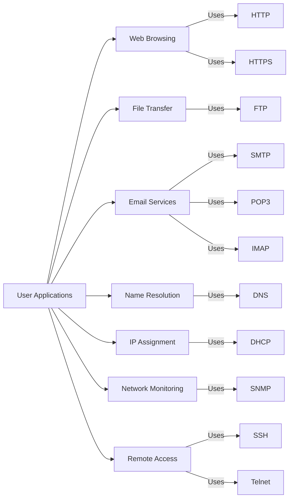
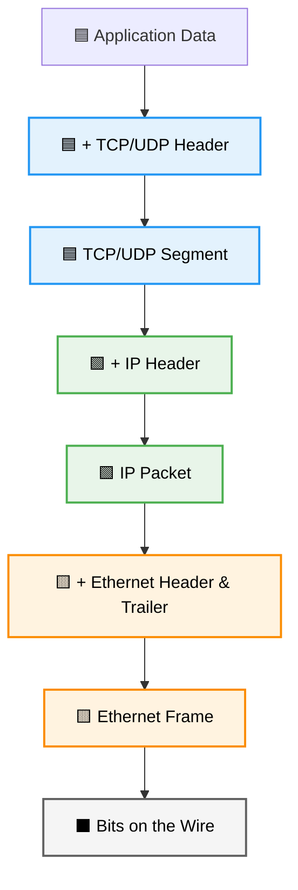
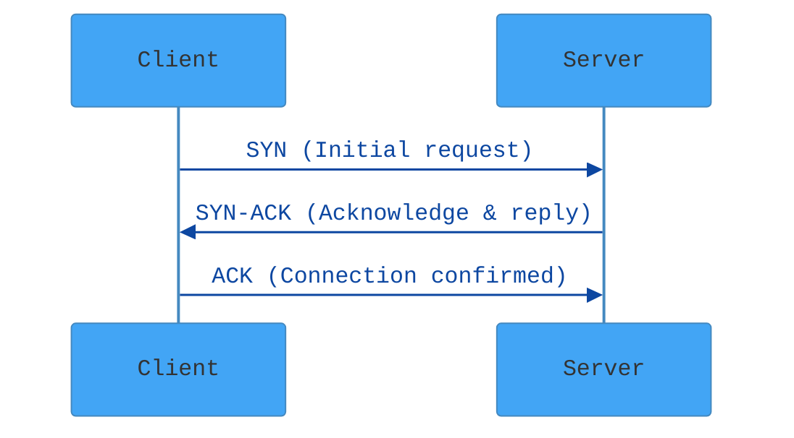
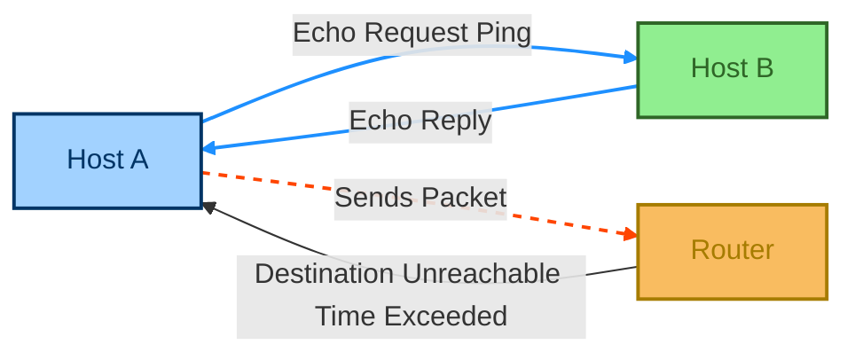
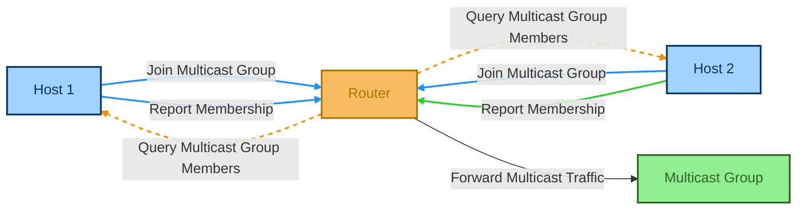
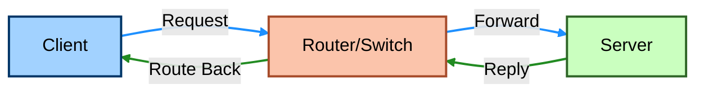
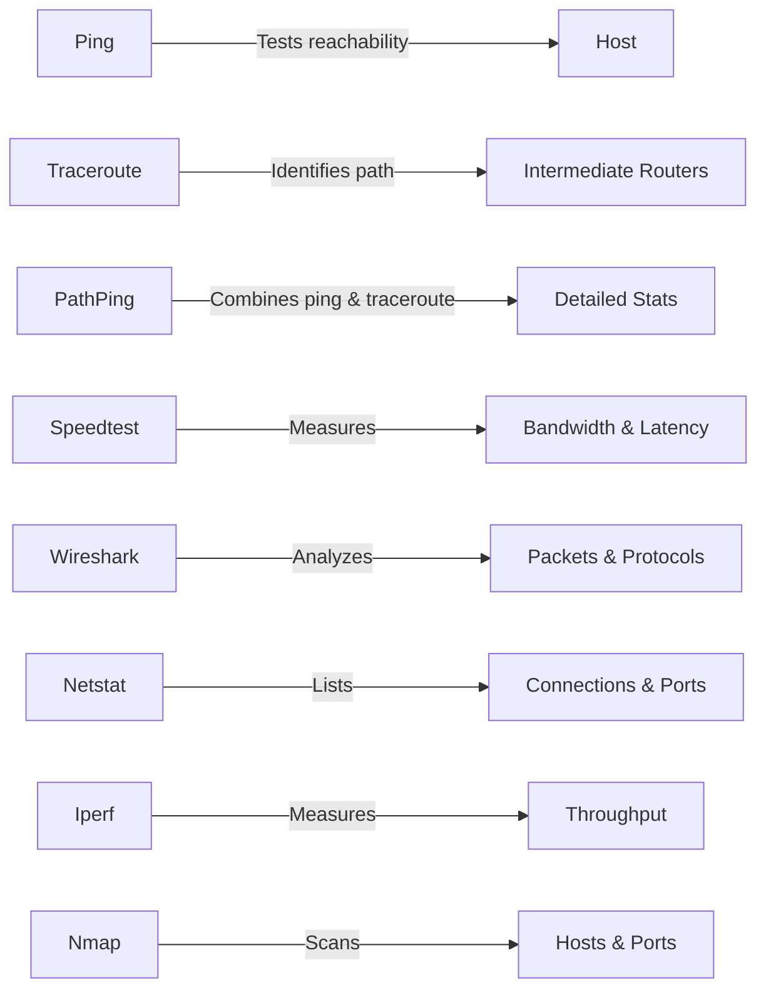
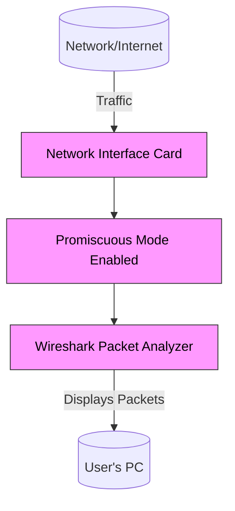
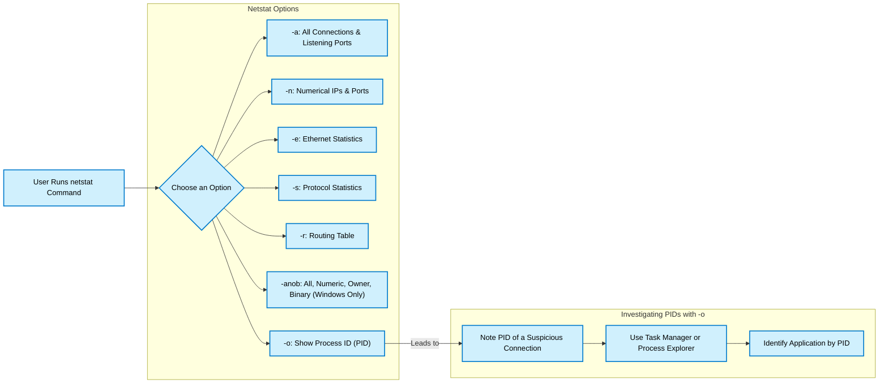
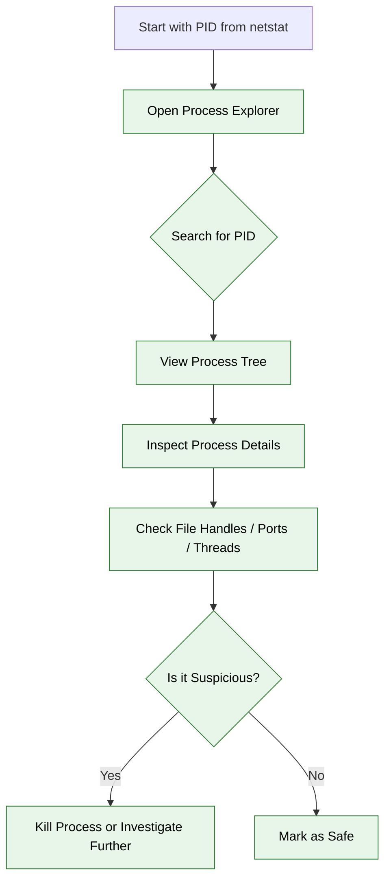

## 📡 TCP/IP Applications

The **TCP/IP model** defines how data is transmitted across networks and includes a wide range of application-layer protocols used on the Internet.

### 🌐 Common TCP/IP Application Protocols

| Protocol | Purpose |
|---------|---------|
| HTTP/HTTPS | Web browsing |
| FTP | File transfer |
| SMTP/POP3/IMAP | Email transmission and retrieval |
| DNS | Resolves domain names to IPs |
| DHCP | Assigns IP addresses dynamically |
| SNMP | Network management |
| SSH/Telnet | Remote command-line access |

---

## 🔗 TCP and UDP

TCP and UDP are the main **transport layer** protocols in the TCP/IP suite.

### 🧱 TCP (Transmission Control Protocol)
- **Connection-oriented**
- **Reliable** — guarantees delivery using acknowledgments
- **Ordered** delivery
- Uses **3-way handshake** to establish connection

### 🚀 UDP (User Datagram Protocol)
- **Connectionless**
- **Unreliable**, but fast
- No error correction or delivery guarantee

### 🧱 TCP vs 🚀 UDP

| Feature | TCP | UDP |
|--------|-----|-----|
| Reliability | ✅ | ❌ |
| Speed | 🚶 Slower | 🏃 Faster |
| Connection | Required | Not required |
| Order | Guaranteed | Not guaranteed |
| Usage | Web, Email | Streaming, VoIP, DNS |

### 📦 Ethernet Frames → IP Packets → TCP/UDP Segments

1. **Ethernet Frame** — Contains MAC addresses and payload (IP packet)
2. **IP Packet** — Contains source & destination IPs, and TCP/UDP segment
3. **TCP/UDP Segment** — Transport data to applications

### 🧱 TCP/IP Encapsulation: From Application Data to Bits on the Wire

---

## 🧩 Protocol Data Units (PDUs)

| OSI Layer | PDU Name |
|-----------|----------|
| Application | Data |
| Transport | Segment (TCP) / Datagram (UDP) |
| Network | Packet |
| Data Link | Frame |
| Physical | Bits |

---

## 🤝 TCP 3-Way Handshake

1. **SYN** — Client requests connection
2. **SYN-ACK** — Server acknowledges and responds
3. **ACK** — Client confirms, connection established

---

## 🛰️ ICMP (Internet Control Message Protocol)

Used for diagnostic and control messages between devices.

### ✨ Key Functions:
- Ping (echo request/reply)
- Traceroute
- Destination unreachable
- Time exceeded

> ICMP is not for data transfer, but for error handling and diagnostics.

---

## 📢 IGMP (Internet Group Management Protocol)

Used by hosts and routers to manage **multicast group memberships**.

### 📺 Multicast = One-to-Many
- Example: Streaming a live video to multiple users.

### IGMP Versions:
- **IGMPv1** – Basic join/leave multicast group
- **IGMPv2** – Adds leave message
- **IGMPv3** – Source filtering (joins specific source)

---

## 🚦 Network Traffic Types & Flow

### 🧱 Traffic Units  
- **Bits** – Basic binary data (0s and 1s)  
- **Frames** – Layer 2 unit (Data Link)  
- **Packets** – Layer 3 unit (Network)  
- **Segments/Datagrams** – Layer 4 unit (Transport)  
- **PDU** – Protocol Data Unit, generic data term for each layer

### 🧭 Traffic Types  
| Type        | Description |
|-------------|-------------|
| **Unicast**   | One-to-one communication (most internet traffic) |
| **Broadcast** | One-to-all communication within a local subnet |
| **Multicast** | One-to-many selective delivery (e.g. live streaming) |
| **Anycast**   | One-to-nearest node (e.g. CDN edge server delivery) |

---

## ❌ Common Traffic Problems

| Problem           | Cause                        | Impact                       |
|------------------|------------------------------|------------------------------|
| **Latency**       | Distance, congestion         | Delay in data transmission   |
| **Jitter**        | Variable latency             | Poor audio/video quality     |
| **Packet Loss**   | Congestion, hardware failure | Incomplete or dropped data   |
| **Congestion**    | Traffic overload             | Slow response or timeouts    |
| **Broadcast Storm** | Excessive broadcasts       | Network flooding             |
| **Duplex Mismatch** | Speed/config mismatch      | Collisions and retransmits   |

---

## 🛠️ Network Monitoring & Strategies

### 🧠 Monitoring Methods
- **SNMP** – Monitor and manage network devices
- **Flow Monitoring** – Analyze traffic patterns (NetFlow, sFlow)
- **Packet Capture** – Deep traffic inspection (Wireshark)

### 💡 Optimization Strategies
- **QoS (Quality of Service)** – Prioritize critical applications
- **Traffic Shaping** – Control bandwidth usage per flow
- **VLAN Segmentation** – Reduce broadcast domains
- **Load Balancing** – Distribute traffic across multiple paths
- **Multicast Efficiency** – Use IGMP snooping and PIM

---

## 🧰 Handy Troubleshooting Tools

| Tool           | Function                                       |
|----------------|------------------------------------------------|
| **Ping**        | Test reachability and latency                 |
| **Traceroute**  | Show path and hops to a destination           |
| **PathPing**    | Combines ping and traceroute with loss stats  |
| **Speedtest**   | Measure bandwidth and latency                 |
| **Wireshark**   | Packet-level inspection and protocol analysis |
| **Netstat**     | Show active connections and listening ports   |
| **Iperf**       | Measure network throughput                    |
| **Nmap**        | Network discovery and port scanning           |

--- 

## 🧪 Wireshark – Protocol Analyzer

Wireshark is a free and powerful tool used to **capture and analyze network traffic** at a granular level.

### 🔍 What Wireshark Can Do:
- Inspect packets in real time.
- Decode various protocols (HTTP, TCP, DNS, etc.).
- Apply filters to focus on specific traffic.
- Identify abnormal or malicious activity.
- Follow TCP streams and reconstruct sessions.

### 🛠️ Use Cases:
- Troubleshooting network problems.
- Debugging protocol implementations.
- Network performance monitoring.
- Security forensics and investigation.

> Wireshark operates in **promiscuous mode** to capture all packets visible to the interface.

---

## 📡 Netstat – Network Statistics

Netstat is a built-in command-line tool that provides information about **network connections, routing tables, and interface stats**.

### 📋 Common `netstat` Commands:

| Command | Description |
|---------|-------------|
| `netstat -a` | Displays all connections and listening ports |
| `netstat -n` | Shows IP addresses and port numbers numerically |
| `netstat -o` | Shows owning process ID for each connection |
| `netstat -e` | Shows Ethernet statistics |
| `netstat -s` | Displays statistics by protocol |
| `netstat -r` | Shows the routing table |
| `netstat -anob` | Displays all connections with numeric IPs, owners, and binaries (Windows) |

### 🧠 Explanation Flow:
1. Use `netstat -a` to see open ports.
2. Use `netstat -n` to match raw IP addresses and ports.
3. Combine with `-o` to identify which process is using a connection.
4. Use `Task Manager` or `Process Explorer` to investigate the PID.

---

## 🧭 Process Explorer (Bonus)

Process Explorer from Microsoft Sysinternals gives deep insight into running processes.

### 🔍 Why Use It:
- View process tree and hierarchy.
- Inspect which process has a file, directory, or port open.
- Identify suspicious or heavy processes.
- Investigate the origin of a PID found via Netstat.

> It's like **Task Manager on steroids**.

